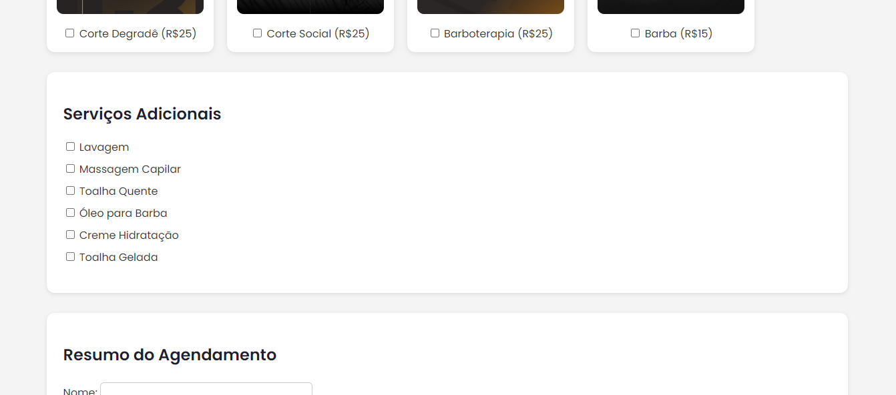
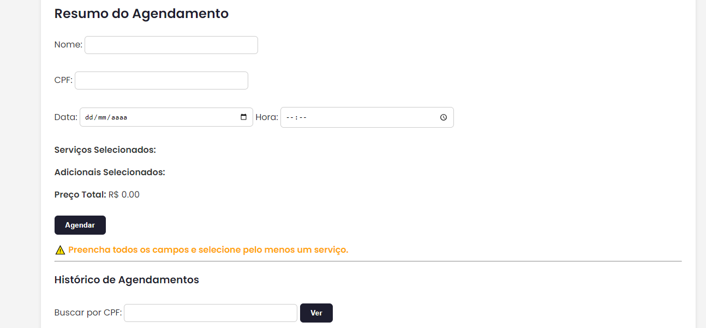

# Projeto BarberTime

O BarberTime é um sistema completo de agendamento para barbearias. Permite ao cliente selecionar múltiplos serviços (como Corte Degradê, Barba, Barboterapia, etc.), escolher serviços adicionais, visualizar o valor total e agendar uma data e hora. Também é possível consultar o histórico de agendamentos por nome ou CPF.

O sistema é uma aplicação **fullstack**, incluindo:
- Front-end responsivo
- Back-end com Node.js + Express
- Banco de dados PostgreSQL

---

## Design do Projeto





---

## Como executar a parte Back-end

1. Clone o projeto ou baixe os arquivos para sua máquina.
2. Acesse a pasta do back-end e instale as dependências:

```bash
npm install

## Como executar a parte Back-end

1. Clone o projeto ou baixe os arquivos para sua máquina.
2. Acesse a pasta do back-end e instale as dependências:

```bash
npm install

## Inicie o servidor
node server.js

## Como executar a parte Banco de Dados

1. Crie o banco de dados no PostgreSQL.
CREATE DATABASE barbertime;
2. Execute os scripts SQL na ordem:
table-services.sql
table-additionals.sql
table-appointments.sql

##Como executar o Front-end
1. Abra o arquivo index.html localizado na pasta frontend/
2. Recomenda-se usar extensão como Live Server (VS Code) ou rodar localmente via http-server

## Estrutura de Pastas

📁 frontend/
 ├── index.html
 ├── style.css
 ├── script.js
 └── imgs/

📁 backend/
 ├── server.js
 ├── controller.js
 ├── repository.js
 └── database.js

📁 database/
 ├── table-services.sql
 ├── table-additionals.sql
 └── table-appointments.sql

##Autor: Fábio Eduardo Rodrigues da Silva
##curso: Análise e Desenvolvimento de Sistemas.